# Siri Shortcut: Peak Brainrot Sound Effects

> **iPhone Only** — This guide only applies to Siri Shortcuts on iPhone.

Turn any brainrot sound effect into a Siri Shortcut you can trigger with a tap, a voice command, or your Action Button. Five steps, no extra apps required.

---

## 1. Download a Sound Effect

Go to [soundbuttonsworld.com](https://soundbuttonsworld.com) and browse for the brainrot sound effect you want.

Browse the sound board and tap the download icon on your chosen effect.

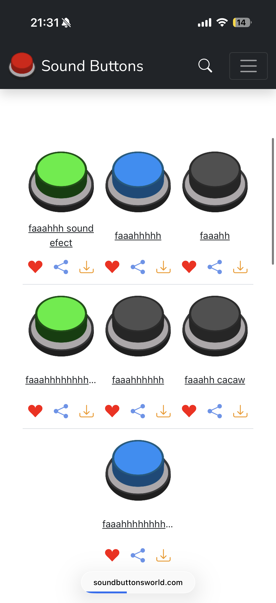

When the download prompt appears, tap **Download** to save the MP3 file to your iPhone.

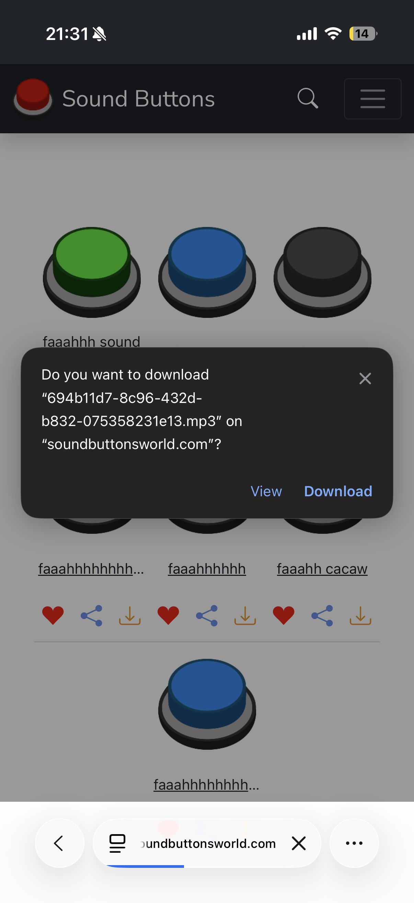

## 2. Encode the MP3 to Base64

Open a Base64 encoder in your browser. A good free option is [codebeautify.org/mp3-to-base64-converter](https://codebeautify.org/mp3-to-base64-converter). Upload the MP3 file you just downloaded.

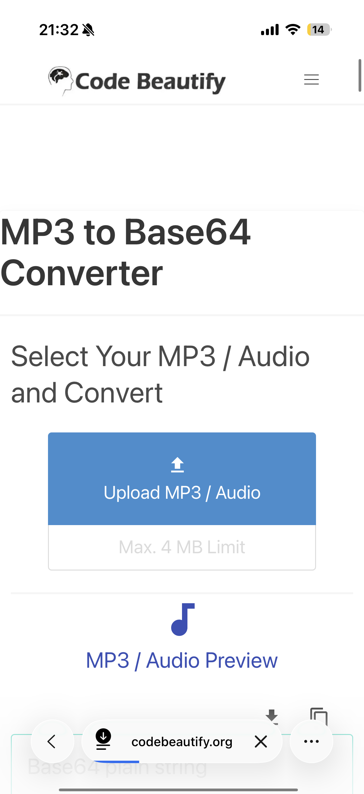

Once the file is processed, copy the entire Base64-encoded text output. Use the copy button next to the output for convenience.

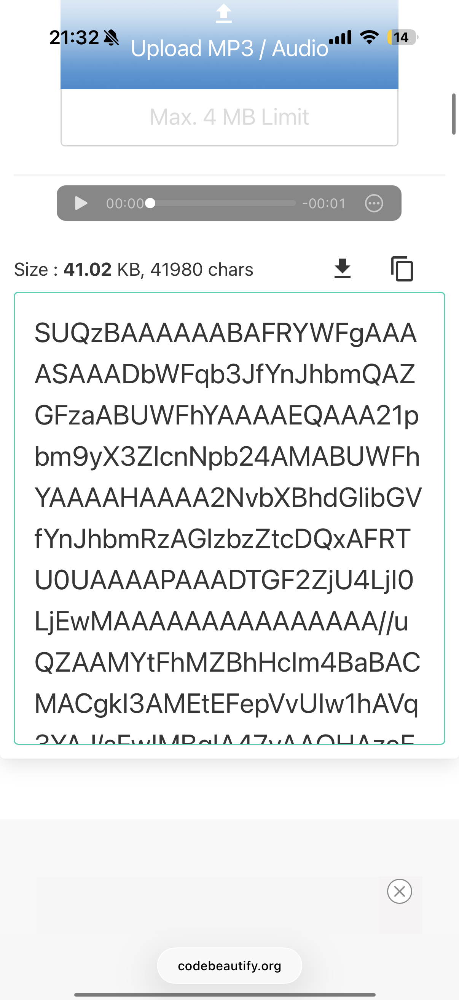

> **Tip:** The encoded text will be very long. Make sure you copy the full string with no truncation.

## 3. Create the Shortcut & Add a Text Action

Open the **Shortcuts** app on your iPhone and tap **+** to create a new shortcut.

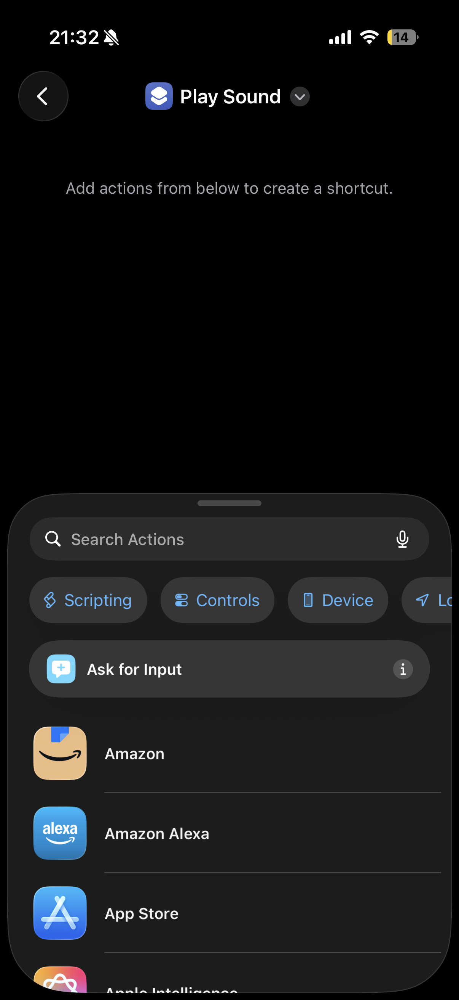

Search for **Text** in the actions search bar and tap the **Text** action (the one with the yellow icon) to add it.

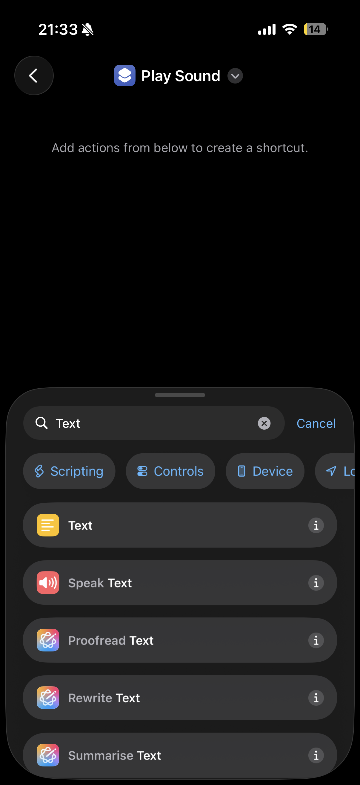

Tap the text field inside the action and paste your Base64-encoded text.

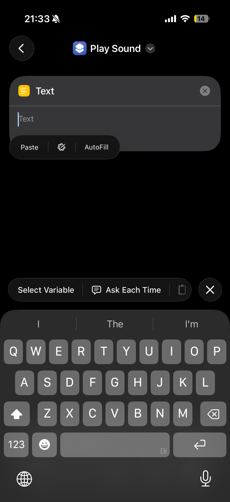

## 4. Add the Base64 Decode Action

Search for **Base64** in the actions search bar and add the **Encode/Decode Base64** action below the Text action.

**Important:** Switch it to **Decode**. The default is Encode, which is the opposite of what you need.

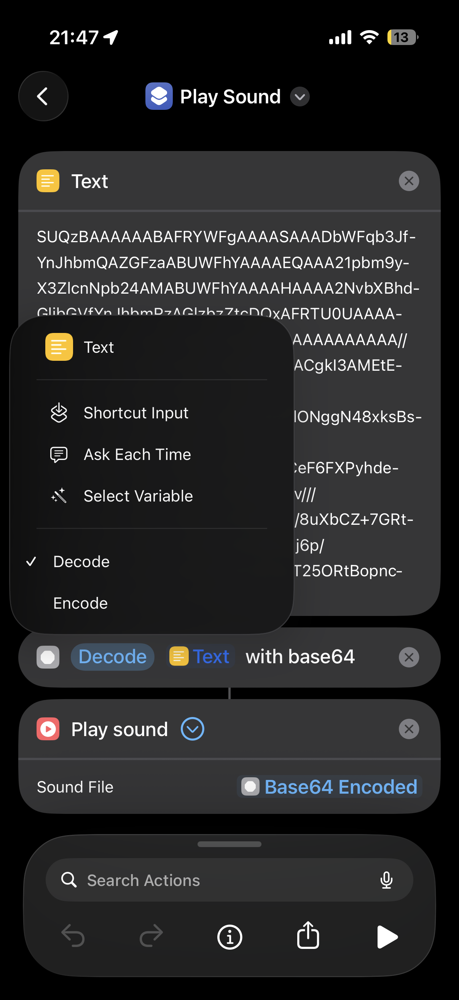

## 5. Add the Play Sound Action

Search for **Play Sound** and add it as the last action. When prompted for the sound file, tap the field and choose **Base64 Encoded** from the variable picker.

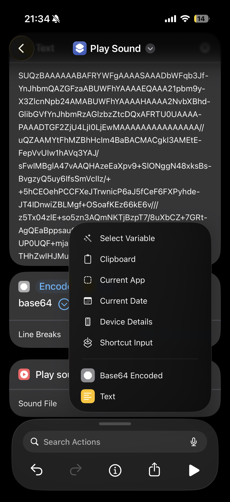

Your shortcut is now ready! Tap the play button at the bottom right to test it.

---

## Bonus: Set It as Your Action Button

If your iPhone has an Action Button (iPhone 15 Pro and later), go to **Settings → Action Button**.

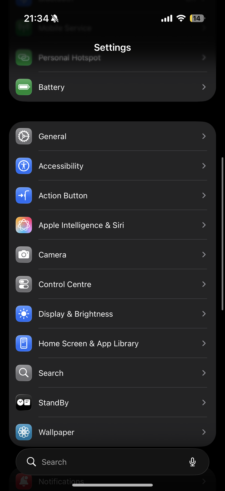

Select **Shortcut** and pick the one you just created. Now you can fire off your brainrot sound effect with a single press of the Action Button.

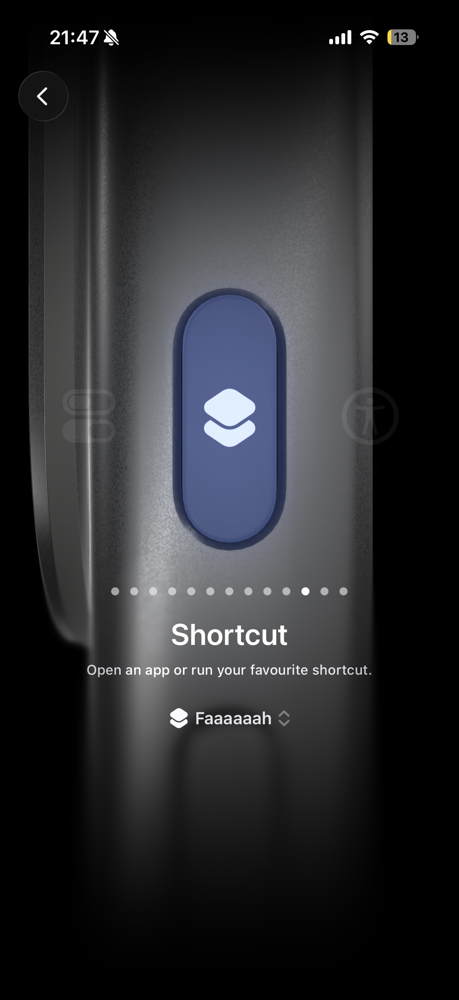

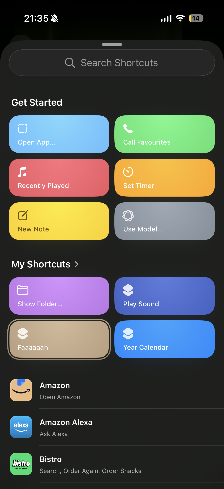

---

You can also trigger it via **Siri voice command**, add it to your **Home Screen**, or run it from the **Shortcuts widget**.
